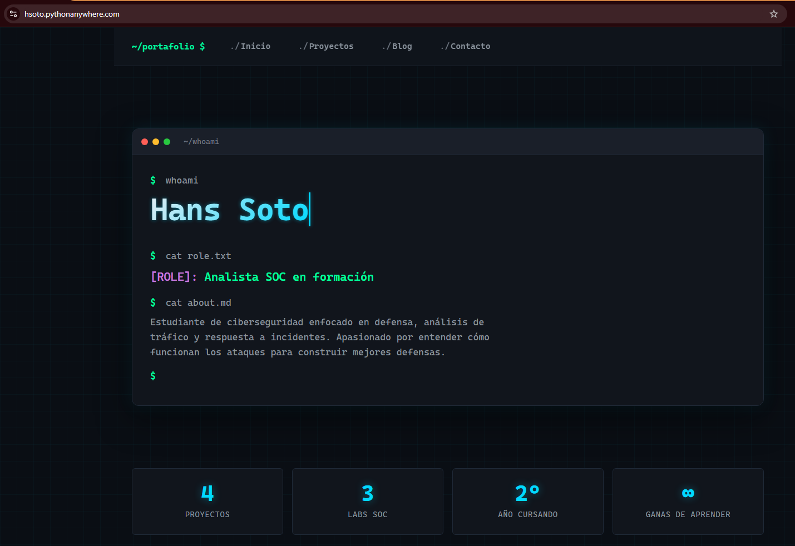

# 🛡️ Portafolio Personal — Hans Soto | Blue Team

> Portafolio web desarrollado con Django para mostrar mi trayectoria como estudiante de ciberseguridad enfocado en defensa y análisis de incidentes.

[](https://www.python.org/)
[](https://www.djangoproject.com/)
[](https://hsoto.pythonanywhere.com)
[](https://opensource.org/licenses/MIT)

🌐 **Demo en vivo:** [hsoto.pythonanywhere.com](https://hsoto.pythonanywhere.com)

---

## 📸 Vista previa



> Diseño inspirado en herramientas SOC reales (Kali Linux, VS Code Dark+) con efecto terminal hacker y animaciones tipo typing.

---

## 🎯 Sobre el proyecto

Este portafolio nació con un objetivo claro: **demostrar mis capacidades técnicas mientras aprendía**. No quería un template prefabricado. Quería construirlo desde cero para que reflejara mi identidad como futuro analista SOC y, en el proceso, dominar el stack web completo.

El sitio integra:
- Sistema de gestión de contenido vía panel admin (sin tocar código para agregar proyectos)
- Blog técnico con slugs amigables para SEO
- Formulario de contacto con persistencia en BD y notificación por email
- Diseño responsive con animaciones tipo terminal

---

## 🧰 Stack tecnológico

| Capa | Tecnología |
|------|------------|
| Backend | Python 3.11, Django 5.2 |
| Base de datos | SQLite |
| Frontend | HTML5, CSS3 con variables, animaciones CSS |
| Tipografía | JetBrains Mono (Google Fonts) |
| Archivos estáticos | WhiteNoise |
| Configuración | python-decouple (variables de entorno) |
| Email | Gmail SMTP con contraseña de aplicación |
| Hosting | PythonAnywhere |
| Control de versiones | Git + GitHub |

---

## ✨ Funcionalidades

### 🏠 Página principal
- Hero estilo terminal con efecto typing animado
- Dashboard de stats (proyectos, labs, año cursando)
- 6 áreas de competencia Blue Team (Monitoreo & SIEM, Seguridad de redes, Análisis de tráfico, Respuesta a incidentes, Administración de sistemas, Automatización)
- Stack tecnológico visual

### 💼 Proyectos
- Catálogo dinámico de proyectos cargados desde el admin
- Vista detallada con imagen, descripción, tecnologías y enlaces a demo/GitHub
- Sistema de proyecto destacado

### ✍️ Blog
- Sistema de artículos con slug automático
- Filtro de publicado/borrador
- Vista de detalle por artículo

### 📬 Contacto
- Formulario con validación
- Persistencia de mensajes en base de datos
- Notificación automática por email al recibir un mensaje
- Mensajes de éxito al enviar

### 🔐 Admin
- Panel de administración Django para gestionar todo el contenido
- Marcar proyectos como destacados sin tocar código
- Lectura de mensajes recibidos
- Slugs autocompletados para artículos

---

## 🚀 Instalación local

### Requisitos previos
- Python 3.11 o superior
- Git
- Editor de código (recomendado: VS Code)

### Pasos

```bash
# 1. Clonar el repositorio
git clone https://github.com/hanssoto-cyber/django-l3.git
cd django-l3

# 2. Crear y activar entorno virtual
python -m venv venv

# Windows
.\venv\Scripts\Activate.ps1

# macOS / Linux
source venv/bin/activate

# 3. Instalar dependencias
pip install -r requirements.txt

# 4. Configurar variables de entorno
# Copia .env.example a .env y completa los valores
cp .env.example .env

# 5. Aplicar migraciones
python manage.py migrate

# 6. Crear superusuario
python manage.py createsuperuser

# 7. Levantar el servidor
python manage.py runserver
```

Abre tu navegador en **http://127.0.0.1:8000** para ver el sitio, o en **http://127.0.0.1:8000/admin** para el panel de administración.

---

## 🔐 Variables de entorno

El proyecto usa `python-decouple` para gestionar configuración sensible. Crea un archivo `.env` en la raíz con:

```env
# Django
SECRET_KEY=genera-una-clave-segura-aqui
DEBUG=True
ALLOWED_HOSTS=127.0.0.1,localhost

# Email (Gmail SMTP)
EMAIL_HOST_USER=tu@gmail.com
EMAIL_HOST_PASSWORD=tu-contraseña-de-aplicacion-16-caracteres
```

Para generar una `SECRET_KEY` nueva:

```bash
python -c "from django.core.management.utils import get_random_secret_key; print(get_random_secret_key())"
```

> ⚠️ El archivo `.env` está incluido en `.gitignore`. **Nunca debe subirse al repositorio.**

---

## 📁 Estructura del proyecto

```
django-l3/
├── portafolio/              # Configuración del proyecto
│   ├── settings.py
│   ├── urls.py
│   └── wsgi.py
├── core/                    # App: inicio, sobre mí, habilidades
├── proyectos/               # App: catálogo de proyectos
├── blog/                    # App: artículos
├── contacto/                # App: formulario de contacto + email
├── templates/               # Templates compartidos (base.html)
├── static/css/              # Estilos personalizados
├── media/                   # Imágenes subidas desde el admin (ignorado en git)
├── docs/screenshots/        # Capturas para el README
├── manage.py
├── requirements.txt
├── .env.example
└── .gitignore
```

---

## 🌐 Despliegue

El sitio está desplegado en **PythonAnywhere** usando:

- WhiteNoise para servir archivos estáticos
- Variables de entorno separadas para producción (`DEBUG=False`)
- SECRET_KEY rotada (la de desarrollo no se usa en producción)
- HTTPS habilitado por defecto

---

## 🎓 Lo que aprendí construyendo este proyecto

Este fue mi primer proyecto Django, partiendo desde **cero conocimiento del framework**. Algunos conceptos clave que dominé:

- 🏗️ Arquitectura proyecto/app de Django
- 🗃️ Modelos, migraciones y ORM
- 🔀 Sistema de URLs anidadas con `include()` y namespaces
- 🎨 Templates con herencia, filtros y tags
- 📝 Formularios con `ModelForm` y validación
- 🛠️ Django Admin como CMS gratuito
- 🔐 Gestión de credenciales con variables de entorno
- 📧 Envío de emails vía SMTP (Gmail con contraseña de aplicación)
- 🌐 Despliegue en PythonAnywhere: WhiteNoise, collectstatic, WSGI
- 🐛 Debugging de errores reales: `DisallowedHost`, `NoReverseMatch`, problemas de encoding UTF-8/UTF-16, drift entre desarrollo y producción

---

## 🗺️ Roadmap

- [x] Configuración inicial del proyecto
- [x] Apps principales (core, proyectos, blog, contacto)
- [x] Modelos y panel admin funcional
- [x] Diseño responsive estilo terminal hacker
- [x] Formulario de contacto con email
- [x] Despliegue público con HTTPS
- [ ] Página 404 personalizada (estilo "command not found")
- [ ] Más artículos de blog técnico
- [ ] Modo claro/oscuro toggle
- [ ] Integración con Google Analytics
- [ ] SEO: sitemap, meta tags, Open Graph
- [ ] Migración a PostgreSQL

---

## 📬 Contacto

**Hans Soto** — Estudiante de Ingeniería en Ciberseguridad

- 🌐 **Portafolio:** [hsoto.pythonanywhere.com](https://hsoto.pythonanywhere.com)
- 💼 **GitHub:** [@hanssoto-cyber](https://github.com/hanssoto-cyber)
- 📧 **Email:** Disponible vía el [formulario de contacto](https://hsoto.pythonanywhere.com/contacto/)

---

## 📄 Licencia

Distribuido bajo la licencia MIT. Consulta el archivo `LICENSE` para más información.

---

<p align="center">
  Hecho con ❤️ y mucho café por <strong>Hans Soto</strong><br>
  Estudiante de Ciberseguridad | Blue Team Focus
</p>